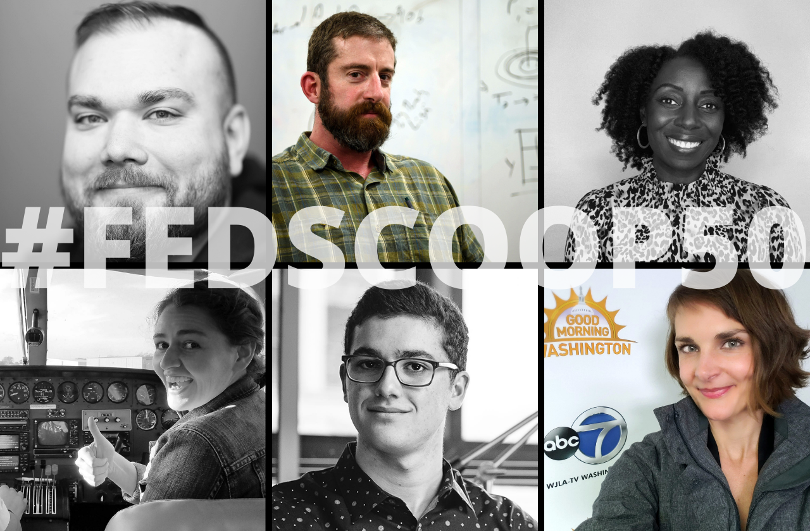

It’s time to vote...for the FedScoop 50 Awards!

Six of our team members and one project have been nominated for the [FedScoop 50 Awards](https://www.fedscoop.com/fedscoop50/vote/), an annual competition designed to highlight and celebrate the best and brightest in the U.S. Federal Government.

No other single government office has as many nominees; DDS has more nominees than several federal departments, too. That is 12% of the federal government’s best and brightest tech minds on one team (more, if you count out each of the team members involved in building BOBA...and we do).

We’re so proud of the recognition. It takes a team to do good work, and an amazing team we have!

Voting has been extended through October 30th and we’re calling on you to [VOTE NOW](https://www.fedscoop.com/fedscoop50/vote/)! Winners will be announced on November 16th. 🤞🏼

* Alexander Romero, Digital Service Expert, is nominated for Cybersecurity Leader of the Year
* Brett Goldstein, DDS Director is nominated for Federal Leadership
* Florence Kasule, Digital Service Expert, is nominated for Disruptor of the Year
* Jack Cable, White Hat Hacker is nominated for Disruptor of the Year
* Katie Olson, Deputy Director, is nominated for Tech Champion of the Year
* Scarlett Swerdlow, Digital Service Expert - Data Science is nominated for Most Inspiring Up and Comer
* Basic Optical Biometric Analysis (Boba), DDS Project, Innovation of the Year

